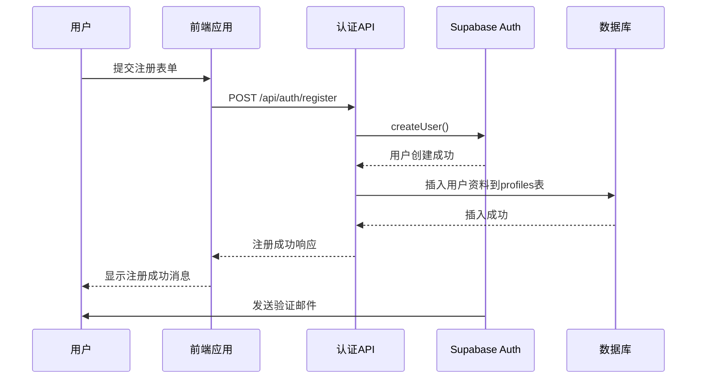
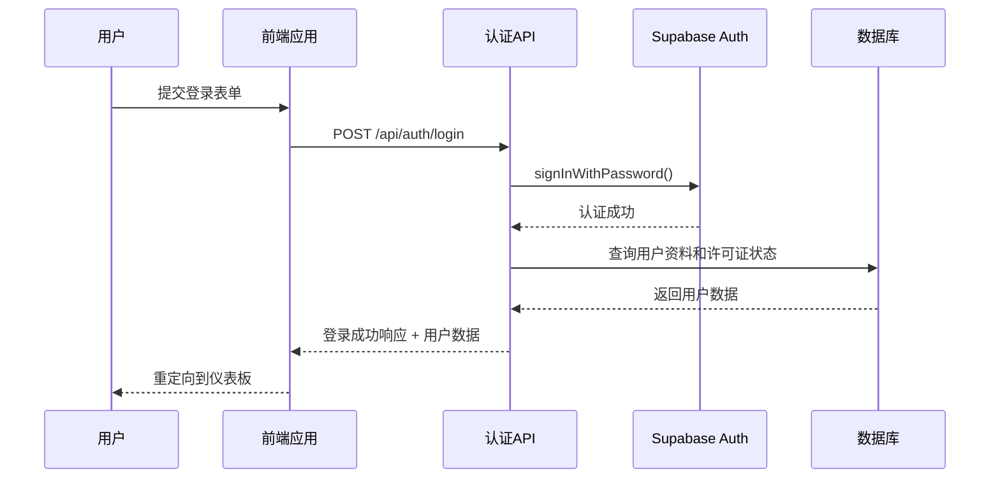
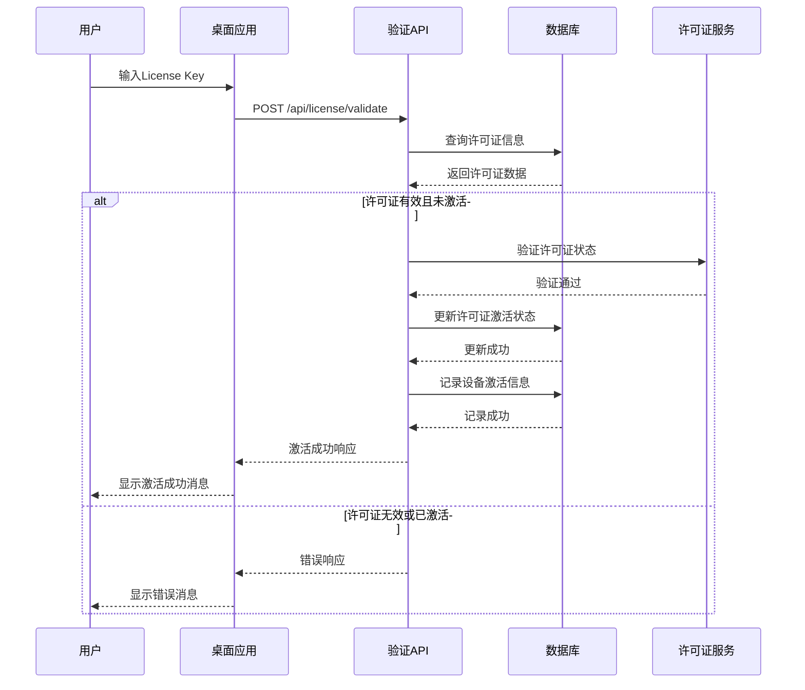
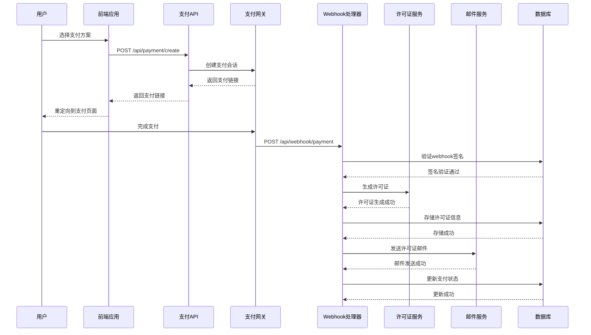
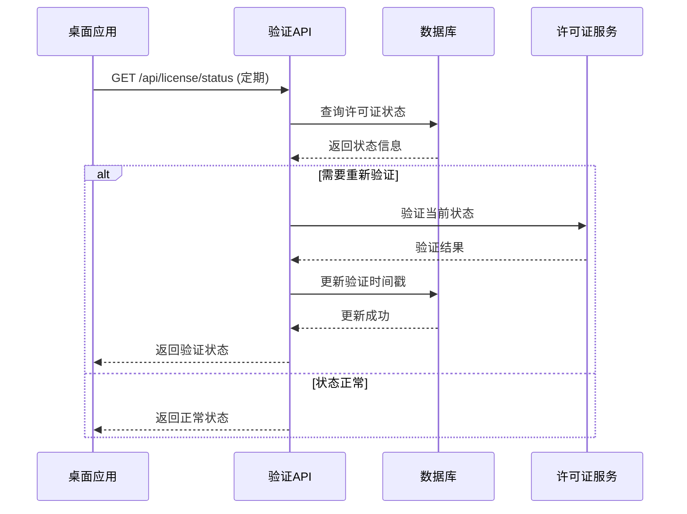
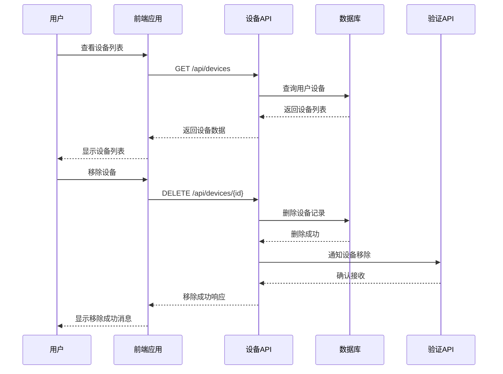
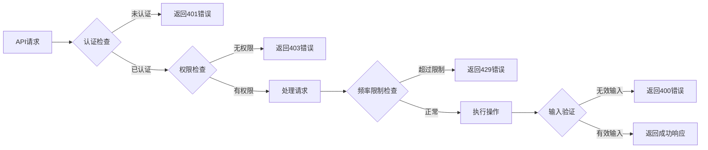
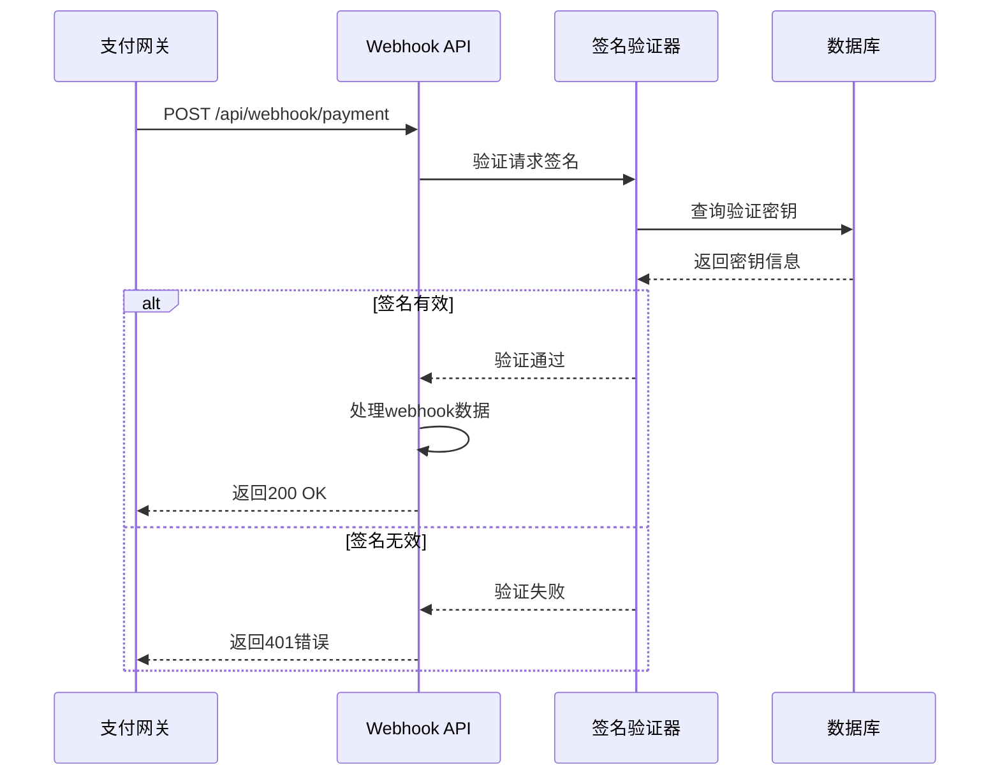
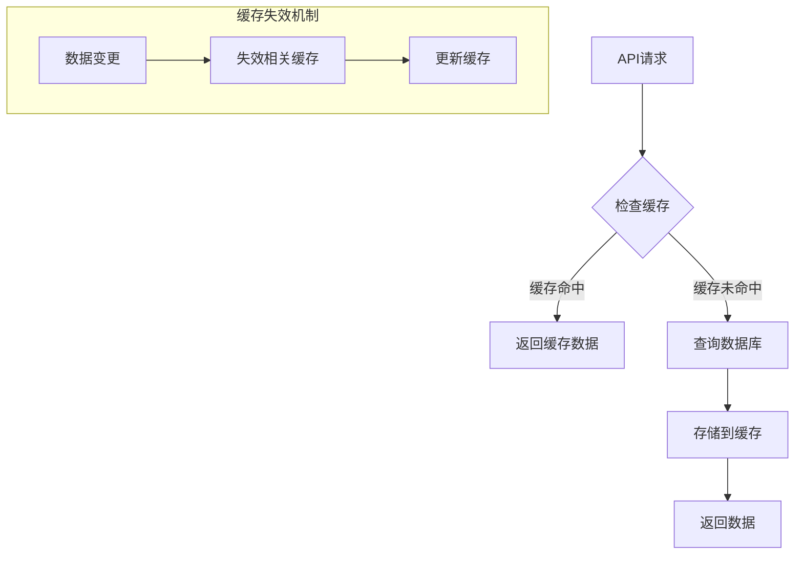
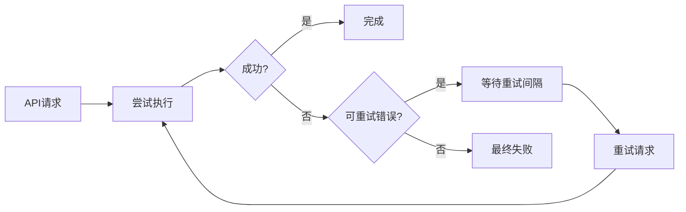

# TopWindow API 交互顺序图

## 🔄 关键API调用序列图

### 用户注册API序列


### 用户登录API序列


### License Key激活API序列


### 支付处理API序列


### 定期验证API序列


### 设备管理API序列


## 🏗️ API架构概览

### 核心API端点

#### 认证API (`/api/auth/*`)
```typescript
// 认证相关端点
POST /api/auth/register     // 用户注册
POST /api/auth/login        // 用户登录  
POST /api/auth/logout       // 用户登出
GET /api/auth/session       // 获取会话信息
POST /api/auth/reset-password // 重置密码
```

#### 许可证API (`/api/license/*`)
```typescript
// 许可证管理端点
POST /api/license/validate  // 验证许可证
GET /api/license/status     // 获取许可证状态
GET /api/license/details    // 获取许可证详情
POST /api/license/transfer  // 转移许可证
```

#### 支付API (`/api/payment/*`)
```typescript
// 支付处理端点
POST /api/payment/create    // 创建支付会话
GET /api/payment/status     // 获取支付状态
POST /api/payment/webhook   // 支付webhook处理
```

#### 设备API (`/api/devices/*`)
```typescript
// 设备管理端点
GET /api/devices           // 获取设备列表
POST /api/devices          // 添加新设备
DELETE /api/devices/{id}   // 移除设备
GET /api/devices/{id}      // 获取设备详情
```

#### Webhook端点 (`/api/webhook/*`)
```typescript
// Webhook处理端点
POST /api/webhook/payment   // 支付webhook
POST /api/webhook/license   // 许可证webhook
```

## 🔐 API安全机制

### 认证和授权


### Webhook安全验证


## 📊 API性能优化

### 缓存策略


### 数据库查询优化
```typescript
// 优化前的查询
const user = await db.user.findUnique({
  where: { id: userId },
  include: {
    licenses: true,
    devices: true,
    payments: true
  }
});

// 优化后的查询 - 按需加载
const user = await db.user.findUnique({
  where: { id: userId },
  select: {
    id: true,
    email: true,
    licenses: {
      select: {
        id: true,
        key: true,
        status: true
      }
    }
  }
});
```

## 🚨 错误处理机制

### API错误响应格式
```json
{
  "success": false,
  "error": {
    "code": "VALIDATION_ERROR",
    "message": "许可证格式无效",
    "details": {
      "field": "licenseKey",
      "reason": "必须为24位字符"
    }
  },
  "timestamp": "2024-01-15T10:30:00Z"
}
```

### 重试机制


## 📈 API监控和日志

### 监控指标
- **响应时间**: P50, P90, P99 延迟
- **错误率**: 4xx和5xx错误比例
- **吞吐量**: 请求每秒 (RPS)
- **缓存命中率**: 缓存效率指标

### 日志结构
```json
{
  "timestamp": "2024-01-15T10:30:00Z",
  "level": "INFO",
  "method": "POST",
  "path": "/api/license/validate",
  "status": 200,
  "responseTime": 150,
  "userId": "user_123",
  "licenseKey": "LIC-XXX-XXX-XXX",
  "ip": "192.168.1.1"
}
```

---

*此API交互顺序图详细展示了TopWindow系统中关键的业务流程API调用序列，包括认证、许可证验证、支付处理、设备管理等核心功能的API交互模式，为系统开发和维护提供了清晰的架构参考。*