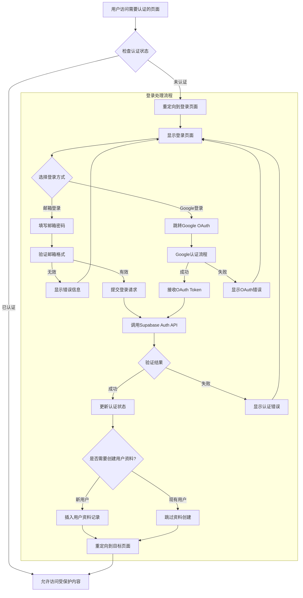

# TopWindow 认证系统流程图

## 🔐 用户认证流程



## 📋 认证方式详细说明

### 邮箱密码登录流程
1. **用户输入**: 用户在登录表单中输入邮箱和密码
2. **前端验证**: 客户端验证邮箱格式和密码强度
3. **API调用**: 调用 Supabase Auth 的 `signInWithPassword` 方法
4. **会话管理**: 成功登录后创建用户会话
5. **状态更新**: 更新 React Context 中的用户状态

### Google OAuth 登录流程
1. **用户点击**: 用户点击"使用Google登录"按钮
2. **重定向**: 跳转到 Google OAuth 认证页面
3. **用户授权**: 用户在Google页面授权应用
4. **回调处理**: Google重定向回应用回调URL
5. **Token交换**: 使用授权码交换访问令牌
6. **用户创建**: 在Supabase中创建或更新用户记录

## 🛡️ 安全措施

### 输入验证
```typescript
// 邮箱格式验证
const emailRegex = /^[^\s@]+@[^\s@]+\.[^\s@]+$/

// 密码强度要求
const passwordRequirements = {
  minLength: 8,
  requireUppercase: true,
  requireLowercase: true,
  requireNumbers: true,
  requireSpecialChars: true
}
```

### 错误处理
- **格式错误**: 立即在前端显示错误信息
- **认证失败**: 显示友好的错误消息，不暴露具体原因
- **网络错误**: 提供重试机制和网络状态提示

## 🔄 会话管理

### 客户端状态管理
```typescript
// AuthContext 提供全局认证状态
interface AuthContextType {
  user: User | null
  loading: boolean
  signIn: (email: string, password: string) => Promise<void>
  signUp: (email: string, password: string, fullName: string) => Promise<void>
  signInWithGoogle: () => Promise<void>
  signOut: () => Promise<void>
}
```

### 服务端保护
```typescript
// 中间件保护路由
const protectedPaths = ['/dashboard', '/profile', '/licenses']

// 检查会话有效性
const { data: { session } } = await supabase.auth.getSession()
if (!session && isProtectedPath) {
  // 重定向到登录页面
}
```

## 📊 用户资料管理

### 用户资料表结构
```sql
CREATE TABLE user_profiles (
  id UUID REFERENCES auth.users(id) PRIMARY KEY,
  full_name TEXT,
  avatar_url TEXT,
  created_at TIMESTAMPTZ DEFAULT NOW(),
  updated_at TIMESTAMPTZ DEFAULT NOW()
);
```

### 自动资料创建
当用户首次注册时，系统会自动创建用户资料记录：
- 从OAuth提供商获取姓名和头像信息
- 为邮箱注册用户设置默认值
- 确保数据一致性

## 🚀 性能优化

### 会话缓存
- 客户端缓存用户状态，减少API调用
- 使用SWR或React Query进行数据缓存
- 实现离线状态检测和优雅降级

### 加载状态优化
- 显示骨架屏加载效果
- 实现渐进式认证状态更新
- 避免页面跳转时的闪烁

---

*此流程图基于 Supabase Auth 集成设计，支持邮箱密码和Google OAuth两种认证方式，提供完整的用户认证和管理功能。*