# TopWindow 数据库关系图

## 🗄️ 数据库表结构和关系



## 📋 表结构详细说明

### auth_users (Supabase内置用户表)
**字段说明**:
- `id`: 用户唯一标识 (UUID)
- `email`: 用户邮箱地址
- `created_at`: 账户创建时间
- `updated_at`: 最后更新时间

### user_profiles (用户资料表)
**字段说明**:
- `id`: 关联auth_users.id (主键和外键)
- `full_name`: 用户全名
- `avatar_url`: 头像URL地址
- `created_at`: 资料创建时间
- `updated_at`: 资料最后更新时间

### products (产品信息表)
**字段说明**:
- `id`: 产品唯一标识 (如: topwindow-license)
- `name`: 产品名称
- `description`: 产品描述
- `price`: 产品价格
- `currency`: 货币类型 (默认USD)
- `license_type`: 许可证类型
- `activation_limit`: 激活设备限制数
- `features`: 产品功能列表 (JSON数组)
- `is_active`: 产品是否激活
- `created_at`: 产品创建时间
- `updated_at`: 产品最后更新时间

### payments (支付记录表)
**字段说明**:
- `id`: 支付记录唯一标识 (UUID)
- `user_id`: 关联用户ID
- `payment_provider`: 支付平台 (creem/paddle)
- `provider_payment_id`: 支付平台交易ID
- `provider_session_id`: 支付会话ID
- `amount`: 支付金额
- `currency`: 支付货币
- `status`: 支付状态 (pending/completed/failed/refunded/cancelled)
- `product_info`: 产品信息快照 (JSON)
- `customer_info`: 客户信息 (JSON)
- `metadata`: 元数据 (JSON)
- `created_at`: 支付创建时间
- `completed_at`: 支付完成时间
- `webhook_received_at`: Webhook接收时间

### licenses (许可证表)
**字段说明**:
- `license_key`: 许可证密钥 (主键)
- `user_id`: 关联用户ID
- `payment_id`: 关联支付记录ID
- `product_id`: 关联产品ID
- `status`: 许可证状态 (active/revoked/expired)
- `activation_limit`: 激活设备限制
- `activated_devices`: 已激活设备列表 (JSON数组)
- `created_at`: 许可证创建时间
- `expires_at`: 许可证过期时间 (NULL表示永久)
- `last_validated_at`: 最后验证时间
- `metadata`: 元数据 (JSON)

### user_devices (用户设备表)
**字段说明**:
- `id`: 设备记录唯一标识 (UUID)
- `user_id`: 关联用户ID
- `license_key`: 关联许可证密钥
- `device_id`: 设备唯一标识
- `device_name`: 设备名称
- `device_type`: 设备类型 (mac/macbook_pro等)
- `device_info`: 设备详细信息 (JSON)
- `first_activated_at`: 首次激活时间
- `last_seen_at`: 最后活跃时间
- `status`: 设备状态 (active/inactive/revoked)

## 🔐 权限控制 (RLS策略)

### user_profiles 表 RLS
```sql
-- 用户只能查看自己的资料
CREATE POLICY "Users can view own profile" ON user_profiles
  FOR SELECT USING (auth.uid() = id);

-- 用户只能更新自己的资料  
CREATE POLICY "Users can update own profile" ON user_profiles
  FOR UPDATE USING (auth.uid() = id);

-- 用户只能插入自己的资料
CREATE POLICY "Users can insert own profile" ON user_profiles
  FOR INSERT WITH CHECK (auth.uid() = id);
```

### payments 表 RLS
```sql
-- 用户只能查看自己的支付记录
CREATE POLICY "Users can view own payments" ON payments
  FOR SELECT USING (auth.uid() = user_id);
```

### licenses 表 RLS
```sql
-- 用户只能查看自己的许可证
CREATE POLICY "Users can view own licenses" ON licenses
  FOR SELECT USING (auth.uid() = user_id);
```

### user_devices 表 RLS
```sql
-- 用户只能查看自己的设备
CREATE POLICY "Users can view own devices" ON user_devices
  FOR SELECT USING (auth.uid() = user_id);
```

## 🗂️ 索引优化

### 支付表索引
```sql
CREATE INDEX idx_payments_user_id ON payments(user_id);
CREATE INDEX idx_payments_provider ON payments(payment_provider);
CREATE INDEX idx_payments_status ON payments(status);
```

### 许可证表索引
```sql
CREATE INDEX idx_licenses_user_id ON licenses(user_id);
CREATE INDEX idx_licenses_status ON licenses(status);
```

### 设备表索引
```sql
CREATE INDEX idx_devices_user_id ON user_devices(user_id);
CREATE INDEX idx_devices_license_key ON user_devices(license_key);
```

## 🔄 数据完整性约束

### 外键约束
```sql
-- user_profiles 引用 auth_users
ALTER TABLE user_profiles 
ADD CONSTRAINT fk_user_profiles_auth_users 
FOREIGN KEY (id) REFERENCES auth.users(id);

-- payments 引用 auth_users  
ALTER TABLE payments
ADD CONSTRAINT fk_payments_auth_users
FOREIGN KEY (user_id) REFERENCES auth.users(id);

-- licenses 引用 auth_users
ALTER TABLE licenses
ADD CONSTRAINT fk_licenses_auth_users
FOREIGN KEY (user_id) REFERENCES auth.users(id);

-- licenses 引用 payments
ALTER TABLE licenses  
ADD CONSTRAINT fk_licenses_payments
FOREIGN KEY (payment_id) REFERENCES payments(id);

-- licenses 引用 products
ALTER TABLE licenses
ADD CONSTRAINT fk_licenses_products
FOREIGN KEY (product_id) REFERENCES products(id);

-- user_devices 引用 auth_users
ALTER TABLE user_devices
ADD CONSTRAINT fk_user_devices_auth_users
FOREIGN KEY (user_id) REFERENCES auth.users(id);

-- user_devices 引用 licenses
ALTER TABLE user_devices
ADD CONSTRAINT fk_user_devices_licenses
FOREIGN KEY (license_key) REFERENCES licenses(license_key);
```

### 唯一性约束
```sql
-- 支付记录唯一性
ALTER TABLE payments
ADD CONSTRAINT unique_payment_provider_id 
UNIQUE (payment_provider, provider_payment_id);

-- 设备唯一性  
ALTER TABLE user_devices
ADD CONSTRAINT unique_license_device
UNIQUE (license_key, device_id);
```

## 📊 默认数据

### 默认产品数据
```sql
INSERT INTO products (id, name, description, price, currency, activation_limit, features) VALUES 
('topwindow-license', 'TopWindow License', 'TopWindow 永久使用许可证', 29.99, 'USD', 3, 
 '["永久使用权", "支持3台设备", "免费更新", "优先技术支持", "30天退款保证"]'::jsonb);
```

---

*此数据库设计采用规范化的表结构，通过外键约束确保数据完整性，使用RLS策略实现行级安全控制，并通过索引优化查询性能。*