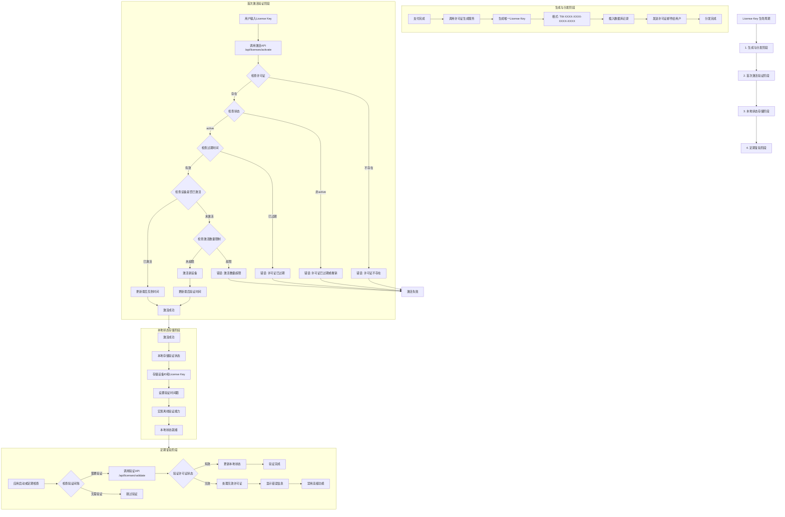

# TopWindow License Key 验证流程图

## 🔑 License Key 四阶段验证流程



## 📋 四阶段详细说明

### 阶段1: 生成与分发
**目的**: 创建唯一的许可证密钥并分发给用户

**流程步骤**:
1. **支付完成触发**: 用户支付成功后触发许可证生成
2. **密钥生成**: 使用UUID和校验码算法生成唯一密钥
3. **数据库记录**: 在licenses表中插入新记录
4. **邮件分发**: 通过Resend服务发送许可证邮件给用户
5. **状态初始化**: 设置许可证状态为active，激活限制为3台设备

### 阶段2: 首次激活验证  
**目的**: 验证许可证有效性并激活设备

**验证逻辑**:
```typescript
// 激活API验证步骤
1. 检查许可证是否存在
2. 验证许可证状态是否为active
3. 检查许可证是否过期
4. 验证设备是否已激活过
5. 检查激活数量是否超限
6. 激活新设备并更新记录
```

### 阶段3: 本地状态存储
**目的**: 在客户端存储验证状态，支持离线使用

**存储内容**:
- License Key 字符串
- 设备唯一标识符
- 最后验证时间戳
- 许可证有效期信息
- 本地验证状态标记

### 阶段4: 定期复验
**目的**: 定期检查许可证状态，确保持续有效性

**复验策略**:
- **启动时验证**: 应用每次启动时检查许可证状态
- **定期检查**: 每24小时自动验证一次
- **网络恢复**: 网络连接恢复时立即验证
- **优雅降级**: 验证失败时提供有限功能模式

## 🗄️ 数据库表结构

### licenses 表 (许可证表)
```sql
CREATE TABLE licenses (
  license_key TEXT PRIMARY KEY,
  user_id UUID REFERENCES auth.users(id) NOT NULL,
  payment_id UUID REFERENCES payments(id),
  product_id TEXT NOT NULL DEFAULT 'topwindow-license',
  status TEXT DEFAULT 'active' CHECK (status IN ('active', 'revoked', 'expired')),
  activation_limit INT DEFAULT 3 NOT NULL,
  activated_devices JSONB DEFAULT '[]'::JSONB,
  created_at TIMESTAMPTZ DEFAULT NOW(),
  expires_at TIMESTAMPTZ, -- NULL表示永久许可
  last_validated_at TIMESTAMPTZ,
  metadata JSONB DEFAULT '{}'::JSONB
);
```

### user_devices 表 (设备信息表)
```sql
CREATE TABLE user_devices (
  id UUID DEFAULT gen_random_uuid() PRIMARY KEY,
  user_id UUID REFERENCES auth.users(id) NOT NULL,
  license_key TEXT REFERENCES licenses(license_key),
  device_id TEXT NOT NULL,
  device_name TEXT,
  device_type TEXT,
  device_info JSONB,
  first_activated_at TIMESTAMPTZ DEFAULT NOW(),
  last_seen_at TIMESTAMPTZ DEFAULT NOW(),
  status TEXT DEFAULT 'active' CHECK (status IN ('active', 'inactive', 'revoked')),
  UNIQUE(license_key, device_id)
);
```

## 🔧 设备ID生成策略

### 设备标识优先级
1. **硬件UUID** (最稳定): 使用系统硬件信息
2. **Keychain存储**: 从macOS Keychain获取持久化ID
3. **随机生成**: 生成新的UUID并保存到Keychain
4. **降级方案**: 使用机器信息哈希作为后备方案

### 隐私保护措施
```typescript
// 哈希设备信息，保护用户隐私
function hashDeviceInfo(info: string): string {
  return crypto
    .createHash('sha256')
    .update(info + 'topwindow-salt')
    .digest('hex')
    .slice(0, 32)
}
```

## 🛡️ 安全验证机制

### API端点安全
- **输入验证**: 验证License Key格式和设备ID格式
- **频率限制**: 防止暴力破解攻击
- **错误处理**: 不暴露具体错误信息，防止信息泄露

### 本地存储安全
- **加密存储**: 敏感信息加密后存储
- **完整性检查**: 防止本地数据篡改
- **自动清理**: 过期数据自动清除

---

*此验证系统采用四阶段工作流程，确保许可证管理的安全性、可靠性和用户体验，支持离线验证和定期状态检查。*