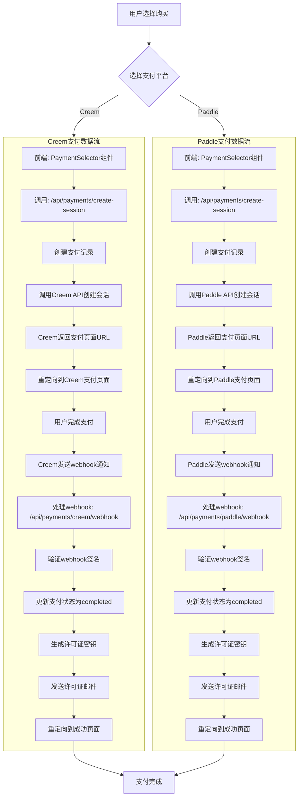
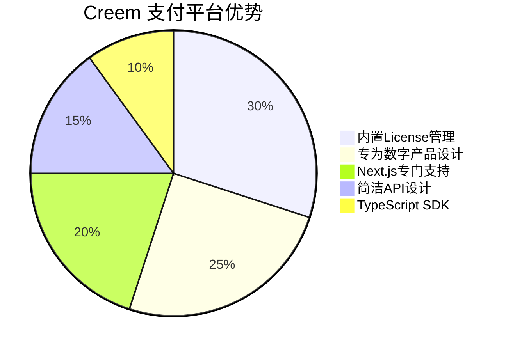
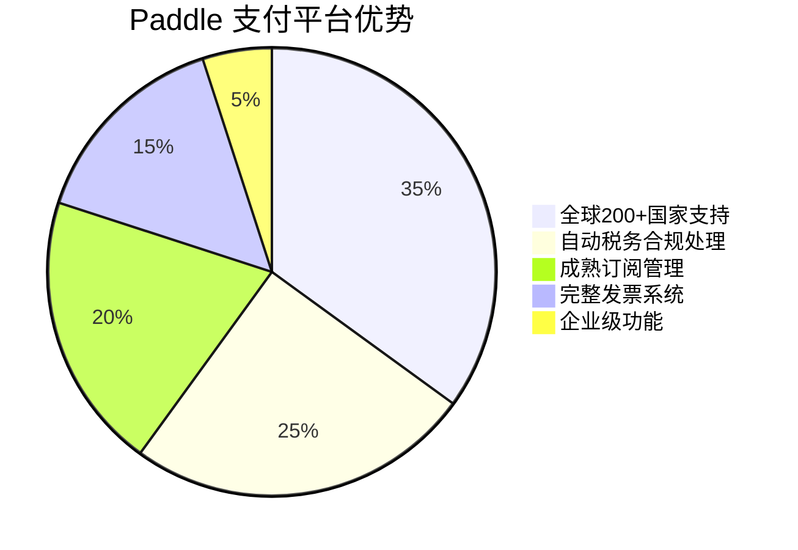

# TopWindow 支付系统数据流图

## 💳 双支付平台集成数据流



## 📊 支付平台对比

### Creem 支付平台
**优势特点**:


### Paddle 支付平台  
**优势特点**:


## 🗄️ 支付相关数据库表

### payments 表 (支付记录表)
```sql
CREATE TABLE payments (
  id UUID DEFAULT gen_random_uuid() PRIMARY KEY,
  user_id UUID REFERENCES auth.users(id) NOT NULL,
  payment_provider TEXT NOT NULL CHECK (payment_provider IN ('creem', 'paddle')),
  provider_payment_id TEXT,
  provider_session_id TEXT,
  amount DECIMAL(10,2) NOT NULL,
  currency TEXT DEFAULT 'USD',
  status TEXT DEFAULT 'pending' CHECK (status IN ('pending', 'completed', 'failed', 'refunded', 'cancelled')),
  product_info JSONB NOT NULL,
  customer_info JSONB,
  metadata JSONB DEFAULT '{}'::JSONB,
  created_at TIMESTAMPTZ DEFAULT NOW(),
  completed_at TIMESTAMPTZ,
  webhook_received_at TIMESTAMPTZ,
  UNIQUE(payment_provider, provider_payment_id)
);
```

### products 表 (产品信息表)
```sql
CREATE TABLE products (
  id TEXT PRIMARY KEY,
  name TEXT NOT NULL,
  description TEXT,
  price DECIMAL(10,2) NOT NULL,
  currency TEXT DEFAULT 'USD',
  license_type TEXT DEFAULT 'standard',
  activation_limit INT DEFAULT 3,
  features JSONB DEFAULT '[]'::JSONB,
  is_active BOOLEAN DEFAULT true,
  created_at TIMESTAMPTZ DEFAULT NOW(),
  updated_at TIMESTAMPTZ DEFAULT NOW()
);
```

## 🔄 统一支付会话创建流程

### API: /api/payments/create-session
```typescript
// 支付会话创建步骤
1. 验证用户认证状态
2. 获取产品信息
3. 创建支付记录
4. 根据选择平台调用相应API
5. 返回支付会话URL
6. 重定向用户到支付页面
```

### Creem 会话创建
```typescript
const creemSession = {
  product_id: product.id,
  amount: Math.round(product.price * 100), // 分为单位
  currency: product.currency,
  customer: {
    email: user.email,
    name: user.user_metadata?.full_name || user.email
  },
  success_url: `${success_url}?payment_id=${payment.id}&provider=creem`,
  cancel_url: `${cancel_url}?payment_id=${payment.id}&provider=creem`,
  metadata: {
    payment_id: payment.id,
    user_id: user.id,
    product_id: product.id,
    generate_license: 'true'
  }
}
```

### Paddle 会话创建
```typescript
const paddleSession = {
  items: [{
    price_id: product.paddle_price_id,
    quantity: 1
  }],
  customer_email: user.email,
  success_url: `${success_url}?payment_id=${payment.id}&provider=paddle`,
  cancel_url: `${cancel_url}?payment_id=${payment.id}&provider=paddle`,
  custom_data: {
    payment_id: payment.id,
    user_id: user.id,
    product_id: product.id
  }
}
```

## 🛡️ Webhook 安全处理

### Creem Webhook 验证
```typescript
function verifyCreemWebhook(body: string, signature: string | null): boolean {
  if (!signature || !process.env.CREEM_WEBHOOK_SECRET) {
    return false
  }

  const expectedSignature = crypto
    .createHmac('sha256', process.env.CREEM_WEBHOOK_SECRET)
    .update(body)
    .digest('hex')

  return crypto.timingSafeEqual(
    Buffer.from(signature),
    Buffer.from(expectedSignature)
  )
}
```

### Webhook 事件处理
```typescript
// 支付完成事件
case 'payment.completed':
  await handlePaymentCompleted(event.data, supabase)
  break

// 支付失败事件  
case 'payment.failed':
  await handlePaymentFailed(event.data, supabase)
  break

// 退款事件
case 'payment.refunded':
  await handlePaymentRefunded(event.data, supabase)
  break
```

## 📧 许可证邮件通知

### 邮件内容模板
```html
<div style="font-family: Arial, sans-serif; max-width: 600px; margin: 0 auto;">
  <h2>🎉 感谢您购买 ${productName}！</h2>
  
  <div style="background-color: #f5f5f5; padding: 20px; border-radius: 8px; margin: 20px 0;">
    <h3>许可证密钥</h3>
    <code style="font-size: 18px; font-weight: bold; color: #0066cc;">${licenseKey}</code>
  </div>
  
  <div style="background-color: #e8f4fd; padding: 15px; border-radius: 6px; margin: 20px 0;">
    <h4>许可证信息</h4>
    <ul>
      <li><strong>产品：</strong>${productName}</li>
      <li><strong>设备限制：</strong>最多 ${activationLimit} 台设备</li>
      <li><strong>有效期：</strong>永久</li>
      <li><strong>更新：</strong>免费更新</li>
    </ul>
  </div>
</div>
```

## 🔧 错误处理和重试机制

### 支付状态跟踪
- **pending**: 支付进行中
- **completed**: 支付成功完成
- **failed**: 支付失败
- **refunded**: 已退款
- **cancelled**: 支付取消

### 异常处理策略
- **网络超时**: 自动重试机制
- **API错误**: 友好错误提示
- **支付失败**: 提供重新支付选项
- **webhook丢失**: 手动状态检查功能

---

*此支付系统支持 Creem 和 Paddle 双平台集成，提供完整的支付处理、webhook验证、许可证生成和邮件通知功能，确保支付流程的安全性和可靠性。*