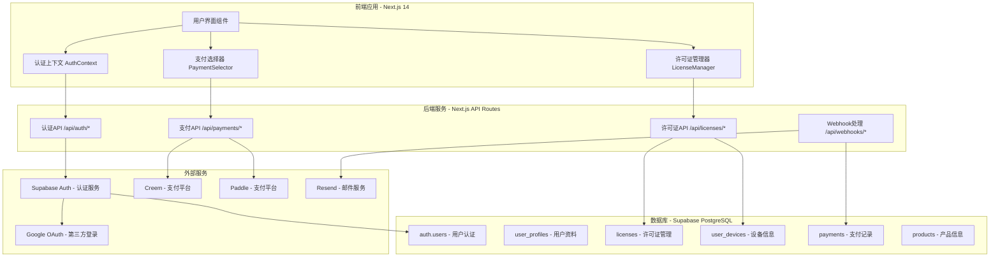

# TopWindow 系统架构图

## 🏗️ 整体系统架构

## 📋 系统组件说明

### 前端层 (Frontend)
- **用户界面组件**: 基于 React + TypeScript + Tailwind CSS
- **认证上下文**: 管理用户登录状态和认证逻辑
- **支付选择器**: 支持 Creem 和 Paddle 双支付平台
- **许可证管理器**: 显示用户许可证和设备信息

### 后端层 (Backend)
- **认证API**: 处理用户注册、登录、登出操作
- **许可证API**: 许可证激活、验证、设备管理
- **支付API**: 创建支付会话、处理支付结果
- **Webhook处理**: 接收支付平台回调通知

### 数据层 (Database)
- **auth.users**: Supabase 内置用户表
- **user_profiles**: 扩展用户信息表
- **licenses**: 许可证密钥和管理信息
- **user_devices**: 用户设备激活记录
- **payments**: 支付交易记录
- **products**: 产品定价和功能信息

### 外部服务 (External Services)
- **Supabase Auth**: 提供认证基础设施
- **Creem**: 主要支付平台，专为数字产品设计
- **Paddle**: 备用支付平台，支持全球支付
- **Resend**: 邮件发送服务，用于许可证分发
- **Google OAuth**: 第三方登录集成

## 🔄 数据流说明

1. **用户认证流程**: 前端 → 认证API → Supabase Auth → 数据库
2. **支付流程**: 前端 → 支付API → 支付平台 → Webhook → 数据库
3. **许可证管理**: 前端 → 许可证API → 数据库
4. **邮件通知**: Webhook → 邮件服务 → 用户邮箱

## 🛡️ 安全架构

- **Row Level Security (RLS)**: 数据库行级权限控制
- **Webhook签名验证**: 防止伪造支付回调
- **输入验证**: 所有API端点都有严格的输入验证
- **环境变量加密**: 敏感配置信息加密存储

## 📊 监控和分析

- **错误监控**: Sentry 集成用于错误跟踪
- **用户分析**: Google Analytics 4 用于用户行为分析
- **性能监控**: Vercel 内置性能监控工具

---

*此架构图基于 TopWindow 技术实施文档创建，反映了系统的整体组件关系和数据流向。*