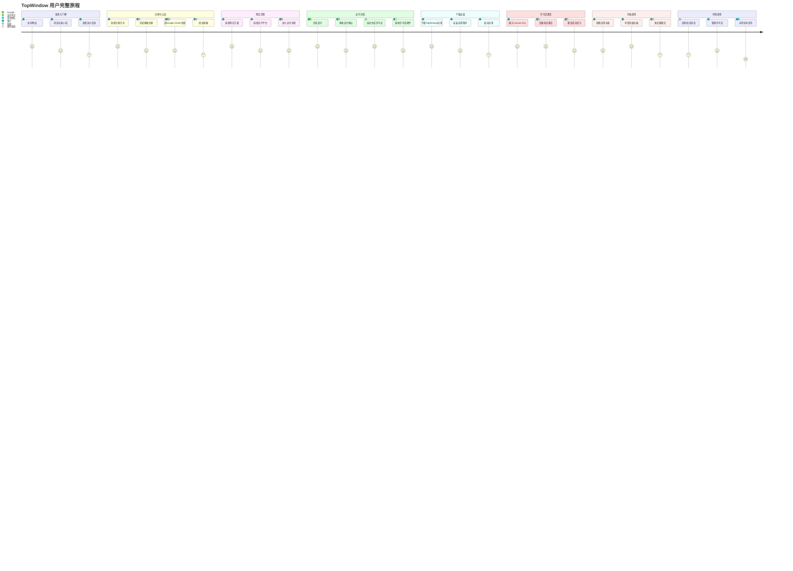

# TopWindow 用户旅程图

## 👤 从注册到激活的完整用户旅程

## 🔄 详细用户旅程流程图

```mermaid
flowchart TD
    Start[用户访问TopWindow网站] --> Discover[发现产品]
    Discover --> Learn[了解功能特性]
    Learn --> Consider[考虑购买]
    
    Consider --> Decide{决定购买}
    Decide -->|是| Register[注册账户]
    Decide -->|否| Exit[离开网站]
    
    subgraph Registration [注册流程]
        Register --> ChooseAuth{选择认证方式}
        ChooseAuth -->|邮箱注册| EmailReg[填写邮箱密码]
        ChooseAuth -->|Google登录| GoogleReg[Google OAuth]
        
        EmailReg --> VerifyEmail[验证邮箱格式]
        VerifyEmail -->|有效| CreateAccount[创建账户]
        VerifyEmail -->|无效| EmailError[显示错误]
        
        GoogleReg --> GoogleAuth[Google认证]
        GoogleAuth -->|成功| ReceiveGoogle[接收用户信息]
        GoogleAuth -->|失败| GoogleError[显示错误]
        
        CreateAccount --> CompleteReg[注册完成]
        ReceiveGoogle --> CompleteReg
    end
    
    CompleteReg --> Purchase[进入购买流程]
    
    subgraph Payment [支付流程]
        Purchase --> SelectProduct[选择产品许可证]
        SelectProduct --> ChoosePayment{选择支付平台}
        
        ChoosePayment -->|Creem| CreemPay[Creem支付]
        ChoosePayment -->|Paddle| PaddlePay[Paddle支付]
        
        CreemPay --> CreemProcess[Creem支付处理]
        PaddlePay --> PaddleProcess[Paddle支付处理]
        
        CreemProcess --> PaymentSuccess[支付成功]
        PaddleProcess --> PaymentSuccess
    end
    
    PaymentSuccess --> PostPayment[支付后处理]
    
    subgraph PostPaymentProcess [支付后流程]
        PostPayment --> GenerateLicense[生成许可证]
        GenerateLicense --> SendEmail[发送许可证邮件]
        SendEmail --> ShowSuccess[显示成功页面]
    end
    
    ShowSuccess --> Download[下载应用程序]
    
    subgraph Activation [激活流程]
        Download --> Install[安装应用]
        Install --> Launch[启动应用]
        Launch --> EnterLicense[输入License Key]
        
        EnterLicense --> Validate[验证许可证]
        Validate -->|有效| Activate[激活设备]
        Validate -->|无效| LicenseError[显示错误]
        
        Activate --> ActivationSuccess[激活成功]
        ActivationSuccess --> Enjoy[开始使用]
    end
    
    Enjoy --> Ongoing[持续使用阶段]
    
    subgraph OngoingUsage [持续使用]
        Ongoing --> RegularUse[日常使用应用]
        RegularUse --> ValidationCheck{定期验证}
        
        ValidationCheck -->|需要验证| Revalidate[重新验证许可证]
        ValidationCheck -->|无需验证| ContinueUse[继续使用]
        
        Revalidate -->|有效| UpdateStatus[更新验证状态]
        Revalidate -->|无效| HandleInvalid[处理无效许可证]
        
        UpdateStatus --> ContinueUse
        HandleInvalid --> LimitedMode[有限功能模式]
    end
    
    EmailError --> EmailReg
    GoogleError --> GoogleReg
    LicenseError --> EnterLicense
```

## 📊 用户旅程阶段分析

### 阶段1: 发现与考虑 (Awareness & Consideration)
**用户目标**: 了解产品价值，决定是否购买
**关键触点**:
- 网站首页和功能展示
- 定价页面和方案对比
- 用户评价和案例研究

### 阶段2: 注册与认证 (Registration & Authentication)  
**用户目标**: 创建账户，建立用户身份
**关键触点**:
- 注册表单或OAuth登录
- 邮箱验证流程
- 用户资料完善

### 阶段3: 购买决策 (Purchase Decision)
**用户目标**: 完成支付交易，获得产品使用权
**关键触点**:
- 支付选择界面
- 支付平台交互
- 支付确认页面

### 阶段4: 交付与激活 (Delivery & Activation)
**用户目标**: 获取产品并开始使用
**关键触点**:
- 许可证邮件通知
- 应用下载和安装
- License Key激活流程

### 阶段5: 使用与价值实现 (Usage & Value Realization)
**用户目标**: 充分利用产品功能，获得价值
**关键触点**:
- 应用功能探索
- 多设备管理
- 定期状态验证

### 阶段6: 支持与成长 (Support & Growth)
**用户目标**: 获得帮助，持续使用产品
**关键触点**:
- 技术支持渠道
- 用户社区和文档
- 产品更新通知

## 🎯 关键用户体验指标

### 转化率指标
- **网站访问 → 注册转化率**: 衡量营销效果
- **注册用户 → 购买转化率**: 衡量产品吸引力  
- **支付完成 → 激活转化率**: 衡量交付体验

### 参与度指标
- **每日活跃用户 (DAU)**: 用户参与程度
- **功能使用频率**: 各功能模块使用情况
- **会话时长**: 单次使用时间长度

### 满意度指标
- **用户满意度评分 (CSAT)**: 直接用户反馈
- **净推荐值 (NPS)**: 用户推荐意愿
- **客户支持满意度**: 支持服务质量

## 🛠️ 用户体验优化点

### 注册流程优化
- **简化表单**: 减少必填字段数量
- **社交登录**: 提供Google等第三方登录
- **进度指示**: 清晰显示注册进度

### 支付流程优化  
- **多种支付方式**: 支持Creem和Paddle双平台
- **支付状态跟踪**: 实时显示支付进度
- **错误恢复**: 支付失败后的重试机制

### 激活流程优化
- **清晰的指引**: 分步指导用户完成激活
- **离线支持**: 支持离线验证功能
- **多设备管理**: 方便的设备激活管理

### 持续使用优化
- **定期提醒**: 许可证状态提醒
- **自动更新**: 后台自动验证状态
- **优雅降级**: 验证失败时的有限功能模式

## 📈 旅程分析工具

### 数据分析集成
- **Google Analytics 4**: 跟踪用户行为流程
- **Hotjar**: 用户会话记录和热图分析
- **Sentry**: 错误监控和性能分析

### 用户反馈收集
- **应用内反馈**: 方便的用户反馈入口
- **满意度调查**: 定期收集用户满意度
- **用户访谈**: 深度了解用户需求和痛点

---

*此用户旅程图完整展示了从首次访问网站到持续使用产品的全过程，帮助理解用户体验流程和优化机会，确保每个阶段都能为用户提供顺畅、有价值的体验。*